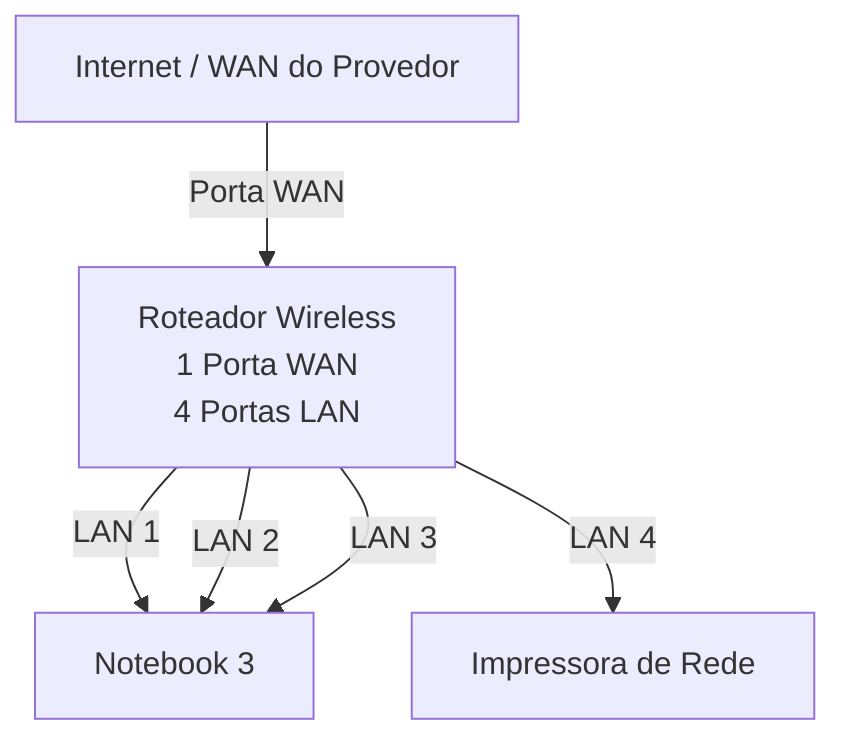

# laboratório de redes 01 - projeto de redes local

Aluno: Geovani Mussulini

Professor: José de Assis

Data: 09/03/2026

## 1. Objetivo
Implementar uma rede local simples conectando 3 notebooks a um roteador
wireless com switch e uma impressora de rede

O projeto será dividido em duas etapas:

1. Simulação de rede Cisco Packet Tracer
2. Implementação da rede no laboratório real

 ---

 ## 2. Equipamento uitilizados nesse laboratório

 - 3 notebooks
 - 1 roteador wireless com 1 porta WAN e 4 portas LAN
 - 1 impressora de rede
 - cabos

---

## 3. Topologia da Rede

Diagrama lógico da rede usada neste laboratório.

