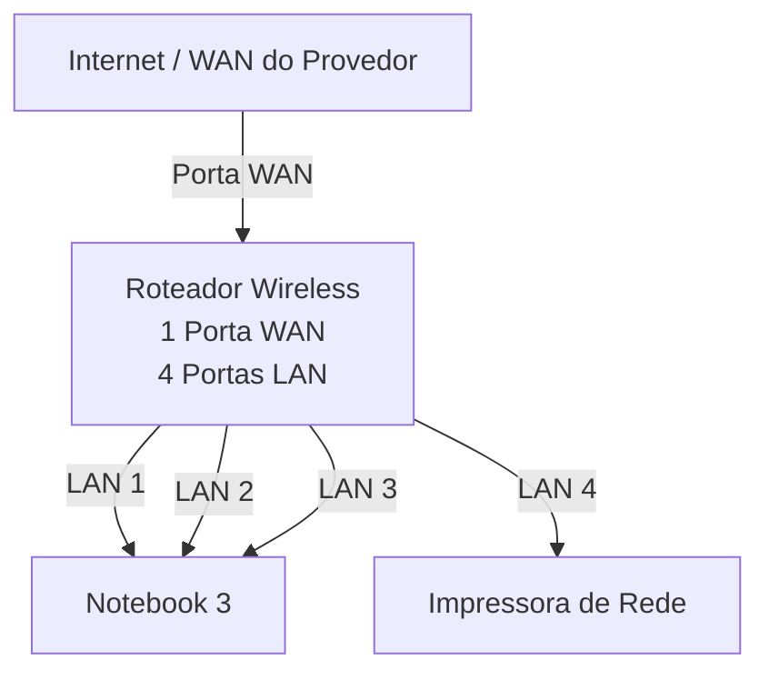

# laboratório de redes 01 - projeto de redes local

Aluno: Geovani Mussulini

Professor: José de Assis

Data: 09/03/2026

## 1. Objetivo
Implementar uma rede local simples conectando 3 notebooks a um roteador
wireless com switch e uma impressora de rede

O projeto será dividido em duas etapas:

1. Simulação de rede Cisco Packet Tracer
2. Implementação da rede no laboratório real

 ---

 ## 2. Equipamento uitilizados nesse laboratório

 - 3 notebooks
 - 1 roteador wireless com 1 porta WAN e 4 portas LAN
 - 1 impressora de rede
 - cabos

---

## 3. Topologia da Rede

Diagrama lógico da rede usada neste laboratório.

Imagem da topologia usada neste laboratório:

---

## 4. Plano de endereçamento IP

Rede: 192.168.0.0/24

Geteway: 192.168.0.1

| Dispositivo | Tipo de IP | Endereço IP | Observação |
|-------------|------------|--------------|------------|
| Roteador | Estático | 192,168.0.1 | IP do roteador|
| impressora | Reserva DHCP | 192.168.0.103 | IP Reservado pelo roteador |
| PC1 | Reserva DHCP | 192.168.0.105 | IP reservado pelo roteador |
| PC2 | DHCP | Automático | IP atribído pelo roteador |
| PC3 | DHCP | Automático | IP atribído pelo roteador |

**Obsevação**

- A impressora e um dos notebooks utilizam reserva DHCP.
- O roteador sempre atribui o mesmo endereço IP a esses dispositivos.

---

## 5. Implementação do Laboratório real

Após a instalação, a rede foi montada fisicamente no laboratório

---

## 6. Conclusão

Este laboratório permitiu compreender o funcionamento de uma rede local simples, incluindo:

- Estrutura de uma rede doméstica ou de pequeno escritorio
- Utilização de um roteador com a porta WAN e portas LAN
- Funcionamento do DHCP
- Comunicação entre dispositivos na rede local
- ~Utilização de uma impressora
